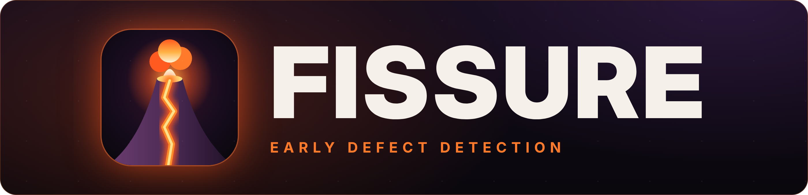
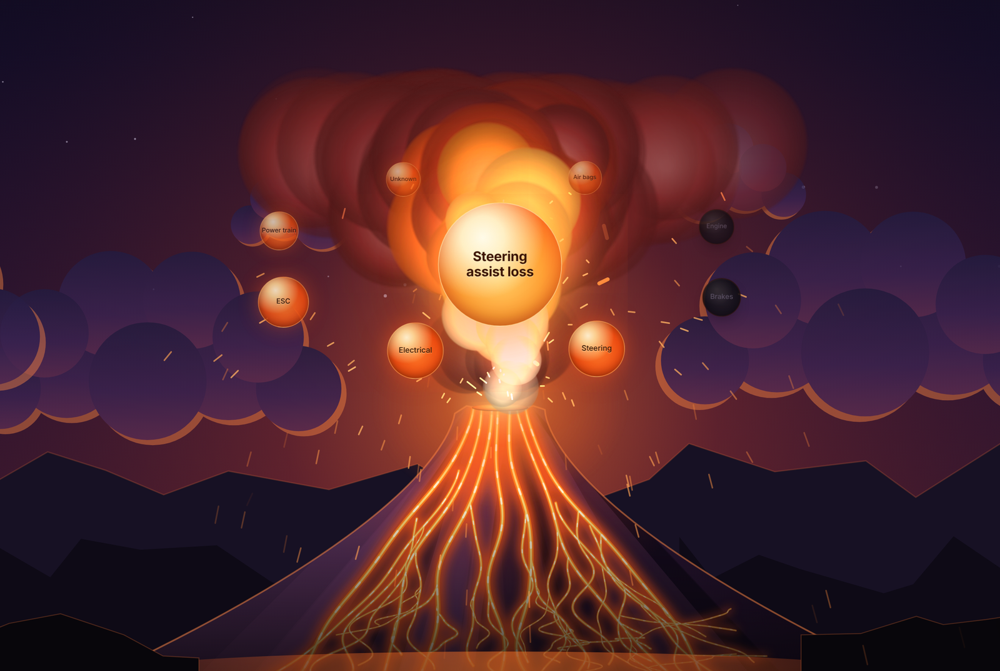
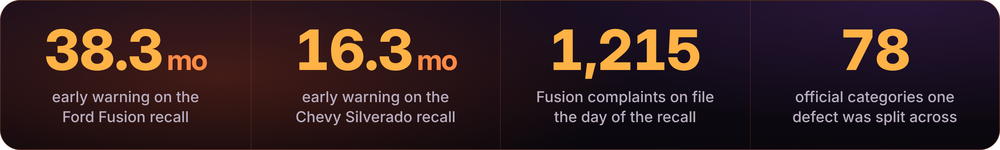
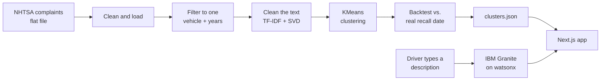

<p align="center">
  
</p>

<hr>

<p align="center">
  <b>Finds car defects hiding in owner complaints, before the recall.</b><br>
  Fissure reads what drivers describe in their complaints instead of the category their complaint got filed under,<br>
  and shows the warning that was sitting in public data for years.
</p>

<p align="center">
  <a href="#results">Results</a> ·
  <a href="#how-it-works-start-to-finish">How it works</a> ·
  <a href="#the-data-pipeline-python">Pipeline</a> ·
  <a href="#the-web-app-nextjs">The app</a> ·
  <a href="#ibm-watsonx-and-granite">IBM watsonx</a> ·
  <a href="#running-it-yourself">Setup</a>
</p>

<p align="center">
            
</p>

<!-- TODO: replace with your Vercel URL -->
<p align="center">
  <a href="https://YOUR-APP.vercel.app"><b>▶ Try the live demo</b></a>
</p>

<hr>

<p align="center">
  
</p>

<p align="center">
  
</p>

> [!NOTE]
> Every number in this README comes from `app/public/clusters.json`, which the pipeline generates from the public NHTSA complaints file. Nothing is typed in by hand.

## Table of contents

1. [The problem](#the-problem)
2. [What Fissure does](#what-fissure-does)
3. [Results](#results)
4. [How it works, start to finish](#how-it-works-start-to-finish)
5. [The data pipeline (Python)](#the-data-pipeline-python)
6. [The web app (Next.js)](#the-web-app-nextjs)
   - [What happens when you use it](#what-happens-when-you-use-it)
   - [File by file](#file-by-file)
7. [IBM watsonx and Granite](#ibm-watsonx-and-granite)
8. [Running it yourself](#running-it-yourself)
9. [Deploying](#deploying)
10. [Project structure](#project-structure)
11. [Honest limitations](#honest-limitations)
12. [What we would build next](#what-we-would-build-next)

---

## The problem

When something goes wrong with a car, owners can file a complaint with NHTSA, the US agency that handles vehicle safety. Every complaint has two parts:

- **A narrative**: the owner's own words, like *"the steering wheel got really heavy while I was turning into a parking lot."*
- **A component code** (called `COMPDESC`): a category like `STEERING` or `ELECTRICAL SYSTEM`.

The categories are the problem. Owners and call-center staff pick them, and they don't agree. For the 2010 to 2016 Ford Fusion, the complaints describing one single defect (the electric power steering cutting out) were filed under **78 different official categories**. Some went under `STEERING`, but others went under `ELECTRICAL SYSTEM`, `ELECTRONIC STABILITY CONTROL`, `AIR BAGS`, `ENGINE`, and dozens more.

If you count complaints by category, the signal gets diluted across all of those buckets. The pattern was sitting in the data for years before the recall, just scattered.

## What Fissure does

Fissure ignores the categories and **reads the narratives instead**. It groups complaints by what drivers actually describe, so complaints about the same failure end up together no matter how they were filed.

There are two halves:

1. **An offline pipeline** (Python) that clusters hundreds of thousands of real NHTSA complaints, then runs a backtest. It asks: if Fissure had been watching back then, when would it have raised a flag, and how does that compare to the date the real recall was filed?
2. **A web app** (Next.js) where you describe a car problem in your own words. IBM Granite reads your description and matches it to a known defect pattern. A volcano erupts, the defect rises out of the crater, and the official categories it was scattered across get thrown out around it. Below that is the full evidence: the complaint timeline, the backtest, and the validation numbers.

## Results

All numbers come straight from `app/public/clusters.json`, which the pipeline generates.

| | Ford Fusion | Chevrolet Silverado |
|---|---|---|
| Model years | 2010 to 2016 | 2015 |
| Defect | Electric power steering assist may fail | Electric power steering assist may cut out, then suddenly return |
| Real recall | **15V-340**, filed Sep 10, 2015 | **18V-586**, filed Jul 9, 2018 |
| Complaints analyzed | 20,327 | 1,829 |
| Fissure would have flagged it | **July 2012** | **March 2017** |
| **Early warning** | **38.3 months before the recall** | **16.3 months before the recall** |
| Complaints already on file the day of the recall | 1,215 | 74 |
| Official categories the defect was split across | 78 | 15 |
| Share of the defect the cluster caught (recall) | 72.0% | 67.7% |
| Share of the cluster that was the defect (purity) | 95.6% | 47.1% |
| Lift over random | 3.05x | 3.47x |

### How to read the early-warning number

The flag rule is simple: **raise a flag once a cluster gets 25 or more complaints in any rolling 12-month window.** That threshold is a policy choice, not a discovery, so the app shows how the answer changes if you pick a stricter one:

| Flag when a cluster reaches... | Fusion flag date | Fusion lead | Silverado flag date | Silverado lead |
|---|---|---|---|---|
| 25 per year | Jul 2012 | 38.3 mo | Mar 2017 | 16.3 mo |
| 50 per year | Mar 2013 | 30.3 mo | never | never |
| 100 per year | Jul 2013 | 26.3 mo | never | never |
| 200 per year | Jan 2014 | 20.3 mo | never | never |

> [!TIP]
> The Fusion gets flagged at least 20 months early under every threshold we tried. The Silverado defect produced fewer complaints, so only the most sensitive threshold catches it.

There's also a threshold-free way to look at it: count how many matching complaints existed at each point before the recall.

| Months before recall | Fusion complaints on file | Silverado complaints on file |
|---|---|---|
| 48 | 7 | 0 |
| 36 | 35 | 1 |
| 24 | 192 | 19 |
| 12 | 527 | 44 |
| 6 | 923 | 58 |
| 1 | 1,179 | 67 |

Two years before the Fusion recall, 192 owners had already described the same failure.

### Vehicles we tested and rejected

> [!IMPORTANT]
> We started with five vehicles and only two made it. The failures are documented here on purpose.

We started with five vehicles. Three didn't hold up, and we kept the reasons instead of hiding them:

- **Honda Civic 2001 to 2005 (Takata airbag, 15V-320).** The clustering found a 98.2% "pure" airbag cluster, but on inspection it was full of complaints saying the airbag **did not** deploy. That's the opposite failure from a Takata inflator *rupturing*. Separately, there was no complaint wave to detect: about 60 complaints a year, flat for 14 years.
- **Jeep Grand Cherokee 2008 (ignition switch, 14V-567).** The manufacturer's own recall report cites about 13 complaints. A volume-based method needs a wave of complaints, and 13 isn't one. The best cluster only reached 1.3x lift.
- **Toyota Camry 2004 to 2009 (floor mat pedal entrapment, 09V-388).** Only 8% of complaints matched the defect at all. Melting dashboards, oil consumption and sun visor failures drowned it out. Best lift was 2.6x and purity never passed 21%.

---

## How it works, start to finish



1. Download the public NHTSA complaints file.
2. Clean it and filter it down to one vehicle and model-year range.
3. Turn each complaint's narrative into numbers that capture its meaning.
4. Group similar complaints with clustering. No categories and no recall information go in.
5. Find the cluster that matches the known defect, then check how good that match is.
6. Replay history month by month to see when the cluster would have crossed the flag threshold.
7. Write everything into one file, `clusters.json`.
8. The web app loads that file. When a user describes a problem, IBM Granite picks the matching defect pattern and the app shows the evidence.

---

## The data pipeline (Python)

Lives in `data/`. Requires Python 3, `pandas` and `scikit-learn`. Every script reads from and writes to `data/processed/`.

### Step 0: Get the raw data

The source is NHTSA's **ODI Complaints flat file**: one big tab-separated text file with 51 columns per complaint, public domain, from nhtsa.gov's datasets page. The ingest step parses it and saves `processed/complaints_clean.pkl`.

> [!IMPORTANT]
> **TODO:** add the name of the ingest script here.

The columns that matter most:

| Column | What it is |
|---|---|
| `MAKETXT`, `MODELTXT`, `YEARTXT` | Make, model, model year |
| `CDESCR` | The owner's narrative, the text we cluster |
| `COMPDESC` | The official component category, **never** used as an input |
| `DATEA` | The date the complaint was **filed** with NHTSA |
| `FAILDATE` | The date the failure happened |

### Step 1: `filter_vehicles.py`, pick the vehicles

Loads the cleaned complaints and saves one file per vehicle (`processed/complaints_<vehicle>.pkl`). The model-year windows match exactly what each real recall covered. For example, the Silverado recall only covered 2015, so we only use 2015 Silverados.

### Step 2: `vectorize.py`, turn words into numbers

Computers can't compare sentences directly, so this step turns each narrative into a list of numbers. Narratives that mean similar things end up with similar numbers.

1. **Throw out complaints that can't help.** That means empty narratives, plus administrative complaints like "the parts for the recall are unavailable" or "I received the recall notice." Those can only exist *after* a recall, so they can't help predict one.
2. **Strip call-center boilerplate.** Many complaints were typed up by NHTSA staff and start with something like `TL* THE CONTACT OWNS A 2013 FORD FUSION...`. Left in, the model groups complaints by *who typed them*, not *what went wrong*.
3. **Remove filler words, but keep "not".** Standard English stopword lists remove words like "the", "a"... and "not". Removing "not" turns *"the airbag did **not** deploy"* into *"the airbag did deploy"*, the exact opposite meaning. We found this bug through the Civic investigation, and the fix keeps `not`, `no`, `never`, `nor` and `cannot`. We also remove story-telling and repair-shop words ("dealer", "repaired", "took it in") that describe what happened *after* the failure, not the failure itself.
4. **TF-IDF.** Scores every word and two-word phrase (like "power steering") by how important it is to one complaint compared to all the others. Up to 20,000 features.
5. **SVD (also called LSA).** Squashes those 20,000 numbers down to 100 "topics", so "steering heavy" and "hard to turn" end up close together even though they share no words.
6. **L2 normalization.** Scales every complaint's vector to the same length. Without this, long complaints and short complaints land in different groups just because of their length, which really reflects writing style.

### Step 3: `cluster.py`, group similar complaints

Runs **KMeans** clustering (fixed random seed, 10 restarts) on the vectors. KMeans splits the complaints into *k* groups where everything in a group is close together.

For each vehicle we try several values of *k* (5, 6, 8, 10) and pick the one where one cluster captures the defect cleanly: Fusion uses k=6 and Silverado uses k=5.

**How we know the clustering is right without cheating.** Each vehicle has a keyword pattern describing its defect (for the Fusion: `POWER STEERING`, `STEERING ASSIST`, `LOSS OF STEERING`...). This pattern **never goes into the clustering**. It's only used afterward, like an answer key, to grade it:

- **Recall:** of all complaints matching the defect keywords, what share landed in our cluster?
- **Purity:** of all complaints in our cluster, what share match the defect keywords?
- **Lift:** how much more concentrated the defect is in our cluster than in the data overall. 1x means no better than random.

The script also prints each cluster's top words, so you can read what each group is about.

### Step 4: `backtest.py`, replay history

This answers: *"If Fissure had been running back then, when would it have spoken up?"*

- **It uses the filing date (`DATEA`), not the failure date.** A warning system can only act on complaints that have actually been filed. Using failure dates would have made the results look better than reality.
- **Dates before a vehicle existed get dropped.** A few complaints have impossible dates, like a 2013 car failing in 2001.
- **The flag month is calculated without looking at the answer.** It's computed from complaint volume alone. Only after that do we compare it to the real recall date, so the result isn't tuned to fit.
- It outputs the evidence table (complaints on file at 48, 36, 24, 18, 12, 6, 3 and 1 months before the recall) and the sensitivity table (flag dates at thresholds of 25, 50, 100 and 200).

### Step 5: `build_clusters_json.py`, write the file the app uses

Regenerates everything from the saved pipeline output and writes `processed/clusters.json`. It's generated by code, not typed by hand, so the numbers on the website always match the analysis. Copy it into the app with:

```bash
cp data/processed/clusters.json app/public/clusters.json
```

What's inside `clusters.json`:

| Key | What it holds |
|---|---|
| `method` | Plain-language summary, preprocessing steps, known limitations |
| `vehicles[].status` | `validated` (shown in the app) or `excluded` (shown with its reason) |
| `vehicles[].meta` | Model years, recall campaign number, recall date, defect description |
| `vehicles[].validation` | Recall, purity, lift, and how many official categories the defect was split across |
| `vehicles[].detection` | Flag rule, flag month, lead time, evidence table, sensitivity table |
| `vehicles[].monthly_series` | Complaints per month, used for the timeline chart |
| `vehicles[].clusters` | Every cluster's size, purity and top words |
| `vehicles[].excluded_because` | For rejected vehicles, the exact reason |

---

## The web app (Next.js)

Lives in `app/`. Built with **Next.js 16** (App Router), **React 19**, **TypeScript**, **Tailwind CSS v4** and **Recharts**. The volcano is hand-drawn SVG plus a 2D canvas, with no 3D library.

### What happens when you use it

1. The page loads `clusters.json`.
2. You type something like *"the wheel suddenly got heavy while I was turning"* and press enter.
3. **The volcano starts rumbling right away.** The screen shakes and the crater heats up. Meanwhile, your description goes to the server, which asks IBM Granite to match it.
4. When the answer comes back, **the volcano erupts**. Lava flows down the slopes, a fire cloud billows up, and sparks fly.
5. The defect ("Steering assist loss") **climbs out of the crater** as a glowing sphere.
6. The official categories the complaints were scattered across (`Steering`, `Electrical`, `ESC`, `Air bags`...) **get thrown out one by one** and orbit the sphere. Bright ones held part of this defect.
7. A card underneath explains the defect, how many drivers described it, and whether Granite or the backup matcher found it.
8. **See the evidence** scrolls down to the timeline and all the proof.

### File by file

Click any file to expand it.

<details>
<summary><b><code>app/layout.tsx</code></b></summary>

The outer shell of every page. Loads the **IBM Plex Sans** and **IBM Plex Mono** fonts, a nod to the IBM-sponsored track, and sets the page title and description.

</details>

<details>
<summary><b><code>app/page.tsx</code></b></summary>

The main page. It:
- Fetches `/clusters.json` when the page opens, and shows a helpful error if the file is missing.
- Renders the volcano hero (`<Hero>`) at the top.
- Renders the **evidence section** below it, with a picker to switch between validated vehicles (Fusion, Silverado). For the selected vehicle it shows the headline numbers, the timeline chart, and every evidence panel.
- Scrolls smoothly down to the evidence when you click **See the evidence**.

</details>

<details>
<summary><b><code>app/globals.css</code></b></summary>

All shared styling. It defines the color palette using volcanic names:

| Name | Color | Used for |
|---|---|---|
| `--basalt` | `#08070a` | Page background |
| `--ash` | `#16141a` | Panel backgrounds |
| `--magma` | `#ff5a1f` | Hot accent, "what drivers reported" |
| `--incandescent` | `#ffb245` | The most important numbers |
| `--steel` | blue-gray | Cold accent, "what the regulator did" |

It also styles the search bar, the orbiting category bubbles (`.orbit-node`), the glowing defect sphere (`.core-sphere`), the result card (`.record`), the lava shimmer animation, and turns animations off for anyone whose system is set to reduce motion.

</details>

<details>
<summary><b><code>app/api/match/route.ts</code></b></summary>

The **server-side** endpoint the browser calls with your description. It:
1. Checks the watsonx credentials exist. If not, it returns a `503` and the browser uses the backup matcher.
2. Checks the description is 3 to 600 characters long.
3. Builds a prompt containing your description plus, for each known defect, the vehicle, the official defect description and the 15 words owners used most.
4. Asks Granite to reply with JSON: which defect it matches (or `"none"`), how confident it is, and a one-sentence reason.
5. Double-checks the answer is a real vehicle ID, so the model can't make one up, and sends it back.

Your API key never leaves the server.

</details>

<details>
<summary><b><code>lib/watsonx.ts</code></b></summary>

A small client for IBM watsonx, with no SDK needed:
- **`readConfig()`** reads the four `WATSONX_*` environment variables.
- **`getToken()`** trades your IBM Cloud API key for a temporary login token and remembers it until about 5 minutes before it expires, so most requests skip this step.
- **`chat()`** sends the conversation to the watsonx chat endpoint and returns the model's reply. It gives up after 6 seconds.
- **`extractJson()`** pulls the `{...}` part out of the reply, in case the model adds extra text around it.

</details>

<details>
<summary><b><code>lib/match.ts</code></b></summary>

The **backup matcher**, used when Granite is slow, down or not configured, so the demo never breaks.
- Splits your description into words and drops filler words.
- Expands them with a hand-built synonym list, because owners say "sticky" and "heavy" where engineers say "assist loss". For example, `sticky` also matches `stiff`, `tight`, `binding` and `hard`.
- Scores each vehicle by how many of your words appear in its cluster's top words (earlier words count more), its defect description, and its short title.
- Also contains `shortenCategory()`, which turns long official labels into bubble-sized ones (`ELECTRONIC STABILITY CONTROL (ESC)` becomes `ESC`), and `titleFor()`, which gives each defect its short name for the sphere.

</details>

<details>
<summary><b><code>lib/types.ts</code></b></summary>

TypeScript descriptions of everything in `clusters.json`, so the editor catches typos. It also holds `INK`, the chart color set, which was checked for colorblind-safe contrast.

</details>

<details>
<summary><b><code>lib/scene.ts</code></b></summary>

The shared geometry for the volcano. The scene is designed on a 1600 by 1000 grid with the crater at (800, 565) and the defect sphere at (800, 345).
- **`fit()`** converts grid positions to screen pixels for any window size, scaling to the height on wide screens and cropping the sides on phones.
- **`flankX()`** gives the edge of the cone at any height, so lava rivers stay on the mountain.

The drawing, the canvas and the HTML bubbles all use this one mapping, so they always line up.

</details>

<details>
<summary><b><code>components/Hero.tsx</code></b></summary>

The top section: the logo and name in the corner, search bar, example prompts, volcano, bubbles and result card. It runs the eruption as a **step-by-step sequence**:

| Step | What happens | How long |
|---|---|---|
| `dormant` | Volcano idles with a little smoke | until you search |
| `rumbling` | Heat rises, screen shakes, Granite is asked | 1 second minimum, keeps rumbling (up to 5 s) if Granite is slow |
| `erupting` | Burst, flash, sphere rises, bubbles launch | about 1.1 seconds |
| `resolved` | Lava keeps flowing, bubbles orbit, card appears | until the next search |

Details worth knowing:
- **Everything moves without re-rendering React.** One animation loop writes numbers (`heat`, `erupt`, `shake`) into a shared object and moves the bubbles directly. That keeps it smooth.
- **Camera shake** combines two wobbles at different speeds, which feels like a rumble instead of a buzz. The search bar never shakes.
- **Bubbles launch in order**, about 85 ms apart, each flying out of the crater on an arc. They pass *behind* the sphere so they never cover its title.
- **If nothing matches** (try "my radio is broken"), the volcano settles and a friendly message suggests what to describe.
- **Reduced motion:** if your system asks for less animation, it skips the shaking and particles and goes straight to the result.

</details>

<details>
<summary><b><code>components/Logo.tsx</code></b></summary>

The Fissure volcano mark shown in the top-left corner, drawn as inline SVG so it stays sharp at any size. It's the same art as the favicon. Its crater glow slowly "breathes", and it tilts slightly when you hover over it (styled in `globals.css` under `.brand`).

</details>

<details>
<summary><b><code>components/VolcanoScene.tsx</code></b></summary>

The volcano itself, drawn in two layers.

**The SVG layer (the scenery):** the sky gradient, stars, rim-lit clouds, two mountain ranges, the cone with shaded facets, the crater, the ground, foreground rocks, and about 25 lava rivers.
- The rivers are **generated by code** with a fixed random seed, so they look identical every time. Each one wanders downhill and sometimes forks. A few start lower on the slope, like side vents.
- Before an eruption, the rivers show as **dim cooled cracks**. During an eruption, bright lava "draws" itself down each river from the crater, with a slight delay per river. Once the flow is established, bright blobs keep sliding down and a glowing lava pool forms at the base.

**The canvas layer (the eruption):**
- **Cloud puffs:** a few hundred soft circles that leave the vent white-hot, shoot up, slow down, then roll outward into a mushroom cap. Each cools from white to yellow, orange, red and finally smoky plum. The colors are pre-drawn into 32 images at startup, which keeps it fast.
- **Fire glow:** an extra additive glow on the hottest puffs.
- **Sparks and lava bombs:** streaks that launch upward and fall back with gravity.
- **Flash:** a burst of light at the moment of eruption.

How many puffs and sparks it makes depends on the current phase: a wisp when idle, more while rumbling, a huge burst on eruption, then a steady plume.

</details>

<details>
<summary><b><code>components/Timeline.tsx</code></b></summary>

The main chart. It shows how many complaints describing the defect were filed each month.
- **Orange area:** what drivers reported.
- **Amber dashed line:** the month Fissure would have raised a flag. The shaded band between it and the recall is the early-warning window.
- **Blue line:** the month the recall was actually filed.

It starts zoomed to a year past the recall, with a button to show the full history.

</details>

<details>
<summary><b><code>components/Panels.tsx</code></b></summary>

Every card in the evidence section:

| Panel | What it shows |
|---|---|
| `Headline` | Four big numbers: lead time (highlighted), complaints on file 2 years before, 1 year before, and the number of categories it was split across |
| `EvidencePanel` | Bars showing complaints on file at each point before the recall, with no threshold involved |
| `SensitivityPanel` | The threshold table, with the rule used everywhere highlighted |
| `FragmentationPanel` | The top official categories the defect was scattered across: *why nobody saw it as one problem* |
| `ClusterPanel` | Every cluster the model found, its size, purity and top words, with the flagged one marked |
| `ValidationPanel` | Recall, purity, lift and the campaign number |
| `ExcludedPanel` | The rejected vehicles, each expandable to show why |
| `MethodPanel` | The preprocessing steps and the known limitations |

</details>

<details>
<summary><b><code>scripts/check-watsonx.mjs</code></b></summary>

A setup checker you run once. It reads `.env.local`, tests your API key, **lists the Granite chat models your region actually offers**, and sends one test message. If something is wrong, it tells you what to fix: a bad key, a missing runtime, or a model name that doesn't exist in your region.

</details>

<details>
<summary><b><code>scripts/organize-assets.sh</code> (repo root)</b></summary>

Puts the icon files where Next.js expects them (`app/app/favicon.ico`, `icon.svg`, `apple-icon.png`), copies them into `assets/` for this README, then commits and pushes. It refuses to commit if an `.env` file sneaks in.

</details>

<details>
<summary><b>Icons</b></summary>

`app/app/favicon.ico`, `app/app/icon.svg` and `app/app/apple-icon.png` are picked up by Next.js automatically by their file names. The tiny browser-tab version uses a simplified drawing with a thicker crack, so it still reads at 16 pixels.

</details>


---

## IBM watsonx and Granite

Fissure uses **IBM Granite** (`ibm/granite-4-h-small`) on **watsonx.ai** for one job: understanding a driver's plain-English description and picking which known defect pattern it describes.

The keyword matcher fails on this. A driver might say *"my wheel fights me when I park"* without using a single word from the cluster. Granite matches on meaning and explains its choice in one sentence, which appears on the result card.

The design is deliberately fail-safe:
- The volcano's rumble hides most of the wait for the model.
- If Granite takes longer than 5 seconds, errors out, or isn't configured, the app quietly switches to the keyword matcher. The card says which one was used.
- The model can only answer with a vehicle ID that actually exists, or `"none"`.

---

## Running it yourself

### 1. The web app

```bash
cd app
npm install
cp ../data/processed/clusters.json public/clusters.json   # if not already there
npm run dev
```

Open http://localhost:3000. It works without watsonx, using the keyword matcher.

### 2. Turning on IBM Granite

1. **IBM Cloud API key:** go to cloud.ibm.com, then **Manage → Access (IAM) → API keys → Create**. Copy it right away, because it's only shown once.
2. **watsonx project:** open watsonx.ai, note your region (for example Dallas), and create a new project.
3. **Project ID:** in the project, open **Manage → General** and copy the Project ID.
4. **Attach a runtime:** in **Manage → Services & integrations → Associate service**, attach a **watsonx.ai Runtime**. If the "create" popup errors, create the runtime from the IBM Cloud catalog in the *same region* first, then come back and associate it.
5. Create `app/.env.local`:

   ```bash
   WATSONX_API_KEY=your-ibm-cloud-api-key
   WATSONX_PROJECT_ID=your-project-id
   WATSONX_URL=https://us-south.ml.cloud.ibm.com
   WATSONX_MODEL_ID=ibm/granite-4-h-small
   ```

   `WATSONX_URL` must match your project's region:

   | Region | URL |
   |---|---|
   | Dallas | `https://us-south.ml.cloud.ibm.com` |
   | Frankfurt | `https://eu-de.ml.cloud.ibm.com` |
   | London | `https://eu-gb.ml.cloud.ibm.com` |
   | Tokyo | `https://jp-tok.ml.cloud.ibm.com` |
   | Sydney | `https://au-syd.ml.cloud.ibm.com` |
   | Toronto | `https://ca-tor.ml.cloud.ibm.com` |

6. Check everything works:

   ```bash
   node scripts/check-watsonx.mjs
   ```

   You want three `ok` lines. If your model isn't listed, set `WATSONX_MODEL_ID` to one of the Granite models it prints.

7. Restart `npm run dev`. The result card should now say **"Matched by IBM Granite"**.

> [!WARNING]
> `.env.local` is git-ignored. Never commit your API key.

### 3. The data pipeline

```bash
cd data
python3 -m venv venv && source venv/bin/activate
pip install pandas scikit-learn

# after the ingest step has produced processed/complaints_clean.pkl:
python3 filter_vehicles.py
python3 vectorize.py          # cleans text and builds the vectors
python3 cluster.py            # clusters and saves processed/clustered_<vehicle>.pkl
python3 backtest.py           # prints the evidence and sensitivity tables
python3 build_clusters_json.py
cp processed/clusters.json ../app/public/clusters.json
```

---

## Deploying

The live app runs on **Vercel**:

1. Push the repo to GitHub.
2. On vercel.com, choose **Add New → Project** and import the repo.
3. Set **Root Directory** to `app`.
4. Add the four `WATSONX_*` environment variables.
5. Deploy. Every `git push` to `main` redeploys automatically.

---

## Project structure

```
fissure/
├── README.md
├── assets/                     images used by this README
│   ├── banner/                 README header + stats strip
│   ├── icon/                   logo in several sizes
│   ├── screenshots/
│   └── social-preview.png      GitHub link preview
├── scripts/
│   └── organize-assets.sh      put icons in place, commit, push
├── data/                       Python pipeline
│   ├── filter_vehicles.py
│   ├── vectorize.py
│   ├── cluster.py
│   ├── backtest.py
│   ├── build_clusters_json.py
│   └── processed/              generated files (pickles, clusters.json)
└── app/                        Next.js web app
    ├── app/
    │   ├── api/match/route.ts  server endpoint that asks Granite
    │   ├── layout.tsx          fonts, page title
    │   ├── page.tsx            hero + evidence section
    │   ├── globals.css         colors and shared styles
    │   ├── favicon.ico, icon.svg, apple-icon.png
    ├── components/
    │   ├── Hero.tsx            search, eruption sequence, bubbles, result card
    │   ├── Logo.tsx            the volcano mark in the top-left corner
    │   ├── VolcanoScene.tsx    the volcano drawing and eruption effects
    │   ├── Timeline.tsx        complaints-per-month chart
    │   └── Panels.tsx          all the evidence cards
    ├── lib/
    │   ├── watsonx.ts          IBM watsonx client
    │   ├── match.ts            backup keyword matcher
    │   ├── scene.ts            volcano geometry shared by all layers
    │   └── types.ts            shape of clusters.json, chart colors
    ├── scripts/
    │   └── check-watsonx.mjs   tests your IBM setup
    └── public/
        └── clusters.json       generated by the pipeline
```

---

## Honest limitations

- **It needs a wave of complaints.** If a defect only produces a handful of complaints before its recall (like the Jeep, with about 13), no volume-based method can catch it, however good the clustering is.
- **The lead time depends on the threshold.** A stricter rule flags later. That's why the full sensitivity table is in the app, not just the best number.
- **Three of five vehicles didn't work.** The reasons are documented above and in the app, not hidden.
- **The clusters are tuned per vehicle.** We picked *k* by hand for each vehicle after looking at the results. A production system would need to do this automatically.
- **The keyword "answer key" is imperfect.** It measures the clustering, but it can miss complaints that describe the defect in unusual words, which makes our recall and purity numbers conservative.
- **The matcher only knows defects we've already clustered.** It can't yet discover a brand-new defect from a single user's description.

## What we would build next

- Run the pipeline continuously on new monthly NHTSA data and raise live alerts for clusters that are growing fast.
- Pick *k* automatically and track clusters over time, so a new defect shows up as a new cluster gaining complaints.
- Use Granite embeddings in place of TF-IDF for the clustering itself.
- Cover every make and model, with a dashboard for safety analysts.

---

<p align="center">
  Data: NHTSA Office of Defects Investigation complaints (public domain).<br>
  Built at Hack Dearborn 5 with IBM watsonx.
</p>
